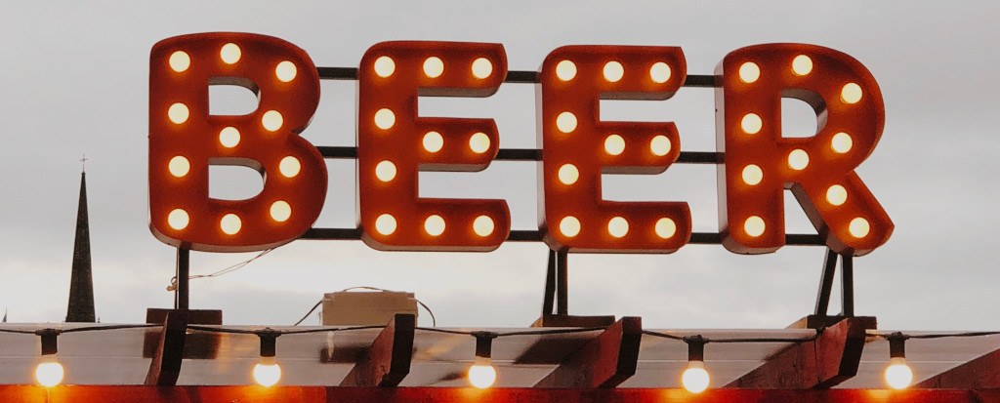

### What is going on here?
We "chartered" under the following shared goals:
- Light obligation(1/hr a week), open-source, side project
- Practice cloud software development and site reliability in a devops era.
- Build a collaborative portfolio that can be showcased in an interview setting.  BOOM TEAMWORK!
- Improve our industry profiles (github presense, technical writing)
- Promote a knowledge sharing and peer mentorship culture.
- Because its not official until you have a mission statement.

### How do you work?
- The Github workflow suite and Slack for coordination work well at this scale.

### Is this effort about beer?
- No, we just like it.

### What is up with the lifter thing?
- Like lifting your drink to toast good fortune.
- Or this: 